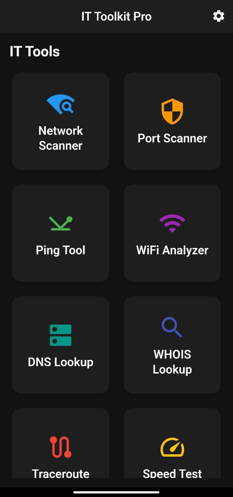
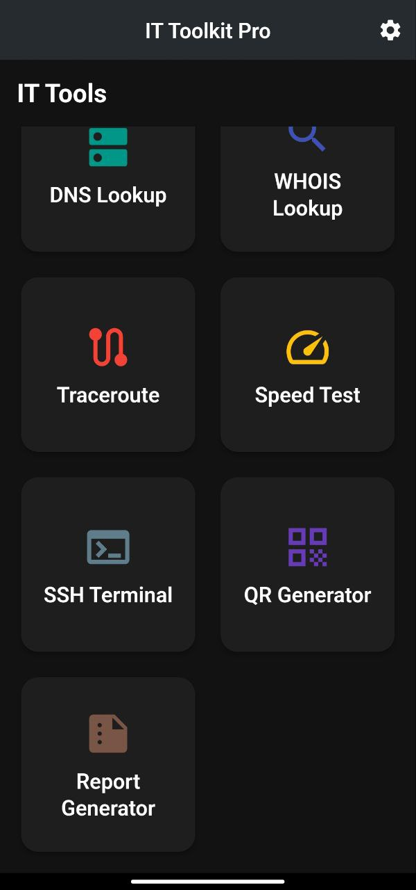
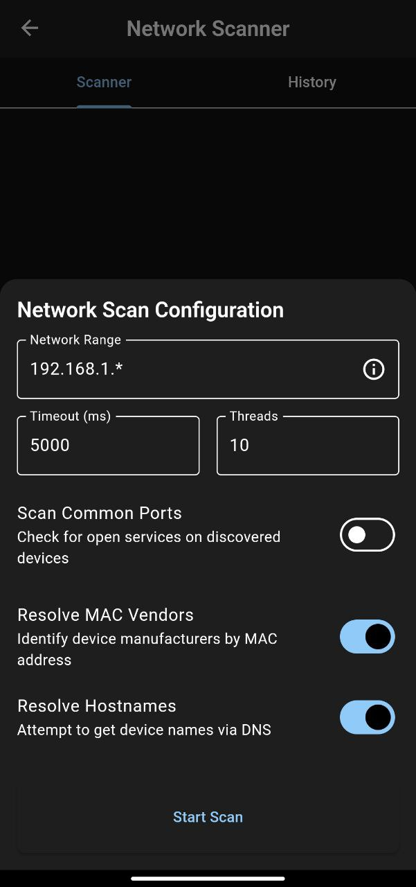
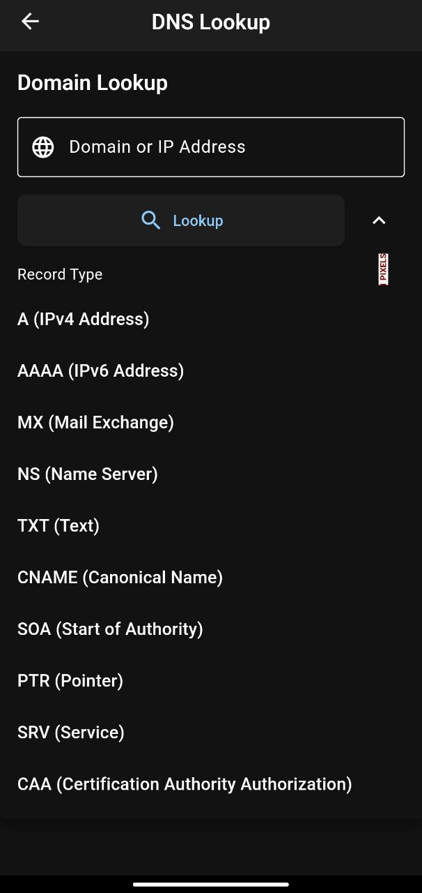
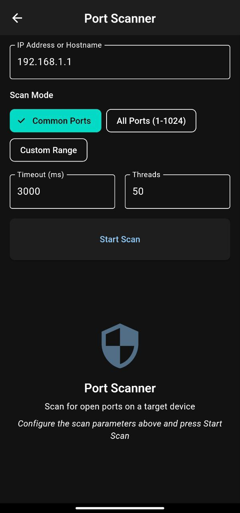

# IT Toolkit Pro 🛠️

<div align="center">
  
  
  [](https://flutter.dev)
  [](https://dart.dev)
  [](LICENSE)
  [](#)
  [](https://github.com/mustafaarkan1/IT-APP/stargazers)
  
  **تطبيق شامل لمهندسي الشبكات ومحترفي تكنولوجيا المعلومات**
</div>

---

## 📖 نظرة عامة

IT Toolkit Pro هو تطبيق متقدم ومتكامل مصمم خصيصاً لمهندسي الشبكات ومحترفي تكنولوجيا المعلومات. يوفر التطبيق مجموعة شاملة من الأدوات المتطورة لتحليل الشبكات، اختبار الاتصال، تشخيص المشاكل، وإدارة البنية التحتية لتكنولوجيا المعلومات بكفاءة عالية.

### 🎯 الهدف من التطبيق
- تبسيط مهام إدارة الشبكات اليومية
- توفير أدوات تشخيص متقدمة في مكان واحد
- تحسين كفاءة العمل لمحترفي IT
- إنشاء تقارير مفصلة وموثقة

---

## ✨ المميزات الرئيسية

### 🔍 أدوات تحليل الشبكات
- **🌐 مسح الشبكة (Network Scanner)**: اكتشاف جميع الأجهزة المتصلة بالشبكة مع تفاصيل شاملة
- **🔌 مسح المنافذ (Port Scanner)**: فحص شامل للمنافذ المفتوحة والخدمات النشطة
- **📶 محلل WiFi (WiFi Analyzer)**: تحليل متقدم لشبكات WiFi مع قياس قوة الإشارة والتداخل

### 🌐 أدوات الاتصال والتشخيص
- **🏓 أداة Ping**: اختبار الاتصال المتقدم مع إحصائيات مفصلة
- **🛤️ Traceroute**: تتبع مسار البيانات عبر الشبكة مع تحليل زمن الاستجابة
- **🔍 DNS Lookup**: البحث الشامل في سجلات DNS مع دعم جميع الأنواع
- **📋 WHOIS Lookup**: الحصول على معلومات تفصيلية لتسجيل النطاقات

### 🚀 أدوات الأداء والإدارة
- **⚡ اختبار السرعة (Speed Test)**: قياس دقيق لسرعة الإنترنت مع رسوم بيانية
- **💻 طرفية SSH (SSH Terminal)**: اتصال آمن ومشفر بالخوادم البعيدة
- **📱 مولد QR**: إنشاء رموز QR للشبكات والبيانات مع خيارات متقدمة
- **📊 مولد التقارير (Report Generator)**: إنشاء تقارير احترافية بصيغة PDF

---

## 📱 لقطات الشاشة

<div align="center">
  
  
  
</div>

<div align="center">
  
  
  
</div>

---

## 🛠️ التقنيات المستخدمة

<div align="center">
  
| التقنية | الوصف | الإصدار |
|---------|--------|--------|
| **Flutter** | إطار العمل الأساسي للتطبيق | 3.4+ |
| **Dart** | لغة البرمجة الأساسية | 3.0+ |
| **Provider & BLoC** | إدارة الحالة المتقدمة | Latest |
| **Hive** | قاعدة بيانات محلية سريعة | 4.0+ |
| **Flutter Secure Storage** | تخزين آمن للبيانات الحساسة | 10.0+ |
| **Dio** | مكتبة الطلبات الشبكية | 5.0+ |
| **FL Chart** | الرسوم البيانية والإحصائيات | 0.68+ |

</div>

---

## 📋 متطلبات النظام

### 📱 Android
- **نظام التشغيل**: Android 6.0 (API level 23) أو أحدث
- **المساحة**: 50 MB مساحة تخزين متاحة
- **الأذونات**:
  - إذن الوصول للشبكة
  - إذن الوصول لمعلومات WiFi
  - إذن الكتابة في التخزين (للتقارير)

### 🍎 iOS
- **نظام التشغيل**: iOS 12.0 أو أحدث
- **المساحة**: 50 MB مساحة تخزين متاحة
- **المتطلبات**: دعم شبكة WiFi

---

## 🚀 البدء السريع

### 📋 متطلبات التطوير

```bash
# تأكد من تثبيت Flutter
flutter --version

# يجب أن يكون Flutter 3.4.1 أو أحدث
flutter doctor

# تأكد من تثبيت Git
git --version
```

### 📥 تحميل المشروع

```bash
# استنساخ المستودع من GitHub
git clone https://github.com/mustafaarkan1/IT-APP.git

# الانتقال إلى مجلد المشروع
cd IT-APP

# التحقق من حالة المستودع
git status
```

### ⚙️ إعداد المشروع

```bash
# تنظيف المشروع (إزالة الملفات المؤقتة)
flutter clean

# تحميل جميع التبعيات المطلوبة
flutter pub get

# إنشاء الملفات المطلوبة للكود المولد
flutter packages pub run build_runner build

# التحقق من صحة الإعداد
flutter doctor -v
```

### 🔧 إعدادات إضافية

#### إعداد Android
```bash
# التأكد من إعدادات Android SDK
flutter config --android-sdk <path-to-android-sdk>

# قبول تراخيص Android
flutter doctor --android-licenses
```

#### إعداد iOS (للمطورين على macOS)
```bash
# تثبيت CocoaPods
sudo gem install cocoapods

# إعداد iOS dependencies
cd ios && pod install && cd ..
```

---

## ▶️ تشغيل التطبيق

### 🔍 التحقق من الأجهزة المتاحة

```bash
# عرض قائمة الأجهزة المتصلة
flutter devices

# عرض المحاكيات المتاحة
flutter emulators

# تشغيل محاكي Android
flutter emulators --launch <emulator_id>
```

### 🚀 تشغيل التطبيق

```bash
# تشغيل في وضع التطوير (Debug Mode)
flutter run

# تشغيل في وضع التطوير مع Hot Reload
flutter run --hot

# تشغيل على جهاز محدد
flutter run -d <device_id>

# تشغيل في وضع الإصدار (Release Mode)
flutter run --release
```

### 📦 بناء التطبيق للنشر

```bash
# بناء APK للأندرويد
flutter build apk --release

# بناء App Bundle للأندرويد (مستحسن لـ Google Play)
flutter build appbundle --release

# بناء IPA للآيفون (يتطلب macOS)
flutter build ios --release

# بناء تطبيق ويب
flutter build web --release
```

---

## 📁 هيكل المشروع

```
IT-APP/
├── 📁 android/                    # إعدادات وملفات Android
│   ├── 📁 app/
│   │   ├── 📄 build.gradle        # إعدادات بناء التطبيق
│   │   └── 📁 src/
│   │       └── 📁 main/
│   │           ├── 📄 AndroidManifest.xml
│   │           └── 📁 kotlin/
│   ├── 📄 build.gradle            # إعدادات المشروع العامة
│   └── 📄 gradle.properties       # خصائص Gradle
│
├── 📁 assets/                     # موارد التطبيق
│   ├── 📁 images/                 # الصور والأيقونات
│   │   ├── 📄 app_logo.png
│   │   └── 📄 splash_screen.png
│   └── 📁 icons/                  # أيقونات التطبيق
│
├── 📁 ios/                        # إعدادات وملفات iOS
│   ├── 📁 Runner/
│   │   ├── 📄 Info.plist          # معلومات التطبيق
│   │   └── 📄 AppDelegate.swift
│   └── 📁 Runner.xcodeproj/
│
├── 📁 lib/                        # الكود الأساسي للتطبيق
│   ├── 📁 core/                   # الملفات الأساسية المشتركة
│   │   ├── 📁 models/             # نماذج البيانات
│   │   │   ├── 📄 network_device.dart
│   │   │   ├── 📄 scan_result.dart
│   │   │   └── 📄 ping_result.dart
│   │   ├── 📁 services/           # الخدمات الأساسية
│   │   │   ├── 📄 storage_service.dart
│   │   │   ├── 📄 network_service.dart
│   │   │   └── 📄 report_service.dart
│   │   ├── 📁 theme/              # تصميم التطبيق
│   │   │   ├── 📄 app_theme.dart
│   │   │   ├── 📄 colors.dart
│   │   │   └── 📄 text_styles.dart
│   │   ├── 📁 utils/              # الأدوات المساعدة
│   │   │   ├── 📄 validators.dart
│   │   │   ├── 📄 formatters.dart
│   │   │   └── 📄 constants.dart
│   │   └── 📁 widgets/            # الواجهات المشتركة
│   │       ├── 📄 custom_button.dart
│   │       ├── 📄 loading_indicator.dart
│   │       └── 📄 error_widget.dart
│   │
│   ├── 📁 features/               # ميزات التطبيق الرئيسية
│   │   ├── 📁 network_scanner/    # مسح الشبكة
│   │   │   ├── 📁 models/
│   │   │   ├── 📁 providers/
│   │   │   ├── 📁 services/
│   │   │   └── 📁 widgets/
│   │   ├── 📁 port_scanner/       # مسح المنافذ
│   │   ├── 📁 ping_tool/          # أداة Ping
│   │   ├── 📁 dns_lookup/         # البحث في DNS
│   │   ├── 📁 whois_lookup/       # البحث في WHOIS
│   │   ├── 📁 traceroute/         # تتبع المسار
│   │   ├── 📁 speed_test/         # اختبار السرعة
│   │   ├── 📁 wifi_analyzer/      # محلل WiFi
│   │   ├── 📁 ssh_terminal/       # طرفية SSH
│   │   ├── 📁 qr_generator/       # مولد QR
│   │   └── 📁 report_generator/   # مولد التقارير
│   │
│   ├── 📁 shared/                 # الملفات المشتركة
│   │   └── 📁 widgets/            # واجهات مشتركة بين الميزات
│   │       ├── 📄 feature_screen.dart
│   │       └── 📄 result_card.dart
│   │
│   └── 📄 main.dart              # نقطة البداية للتطبيق
│
├── 📁 test/                       # اختبارات التطبيق
│   ├── 📄 widget_test.dart
│   └── 📁 unit_tests/
│
├── 📁 web/                        # ملفات تطبيق الويب
├── 📁 windows/                    # إعدادات Windows
├── 📁 linux/                      # إعدادات Linux
├── 📁 macos/                      # إعدادات macOS
│
├── 📄 pubspec.yaml               # تبعيات ومعلومات المشروع
├── 📄 pubspec.lock               # إصدارات التبعيات المثبتة
├── 📄 analysis_options.yaml      # قواعد تحليل الكود
├── 📄 README.md                  # وثائق المشروع
├── 📄 LICENSE                    # ترخيص المشروع
└── 📄 .gitignore                 # ملفات مستبعدة من Git
```

---

## 🤝 المساهمة في المشروع

نرحب بمساهماتكم في تطوير وتحسين IT Toolkit Pro! يرجى اتباع الإرشادات التالية:

### 📝 إرشادات المساهمة

#### 🔧 معايير الكود
- **اتبع معايير الكود المحددة**: استخدم `dart format` لتنسيق الكود
- **استخدم أسماء متغيرات واضحة ومعبرة**
- **اكتب تعليقات توضيحية للكود المعقد**
- **اتبع مبادئ Clean Code و SOLID**

#### 🧪 الاختبارات
- **أضف اختبارات للميزات الجديدة**: اكتب Unit Tests و Widget Tests
- **تأكد من عمل جميع الاختبارات**: قم بتشغيل `flutter test` قبل الإرسال
- **اختبر على أجهزة مختلفة**: Android و iOS
- **اختبر سيناريوهات مختلفة**: حالات النجاح والفشل

#### 📚 الوثائق
- **حدث الوثائق عند الضرورة**: README.md و التعليقات في الكود
- **اكتب وصف واضح للميزات الجديدة**
- **أضف أمثلة على الاستخدام عند الحاجة**
- **حدث changelog عند إضافة ميزات مهمة**

### 🚀 خطوات المساهمة

1. **Fork المستودع**
   ```bash
   # انقر على زر Fork في GitHub
   git clone https://github.com/YOUR_USERNAME/IT-APP.git
   ```

2. **إنشاء فرع جديد**
   ```bash
   git checkout -b feature/amazing-feature
   # أو
   git checkout -b bugfix/fix-issue-123
   ```

3. **تنفيذ التغييرات**
   ```bash
   # اكتب الكود الخاص بك
   # اتبع معايير الكود
   dart format .
   flutter analyze
   ```

4. **إضافة الاختبارات**
   ```bash
   # اكتب اختبارات للكود الجديد
   flutter test
   ```

5. **تسجيل التغييرات**
   ```bash
   git add .
   git commit -m "feat: add amazing feature"
   # استخدم Conventional Commits
   ```

6. **رفع التغييرات**
   ```bash
   git push origin feature/amazing-feature
   ```

7. **فتح Pull Request**
   - اذهب إلى GitHub وافتح Pull Request
   - اكتب وصف واضح للتغييرات
   - أضف screenshots إذا كانت التغييرات تؤثر على UI

### 📋 قائمة التحقق قبل الإرسال

- [ ] الكود منسق باستخدام `dart format`
- [ ] لا توجد تحذيرات في `flutter analyze`
- [ ] جميع الاختبارات تعمل بنجاح
- [ ] تم اختبار الميزة على Android و iOS
- [ ] تم تحديث الوثائق إذا لزم الأمر
- [ ] تم كتابة commit message واضح
- [ ] تم إضافة اختبارات للكود الجديد

---

## 🔧 استكشاف الأخطاء وإصلاحها

### 🐛 المشاكل الشائعة

#### مشكلة في تشغيل التطبيق
```bash
# تنظيف المشروع
flutter clean
flutter pub get

# إعادة بناء المشروع
flutter packages pub run build_runner build --delete-conflicting-outputs
```

#### مشاكل Android
```bash
# إعادة تعيين Gradle
cd android
./gradlew clean
cd ..

# قبول تراخيص Android
flutter doctor --android-licenses
```

#### مشاكل iOS
```bash
# إعادة تثبيت pods
cd ios
rm -rf Pods
rm Podfile.lock
pod install
cd ..
```

### 📞 الحصول على المساعدة

إذا واجهتك مشكلة:
1. تحقق من [Issues](https://github.com/mustafaarkan1/IT-APP/issues) الموجودة
2. ابحث في الوثائق
3. اسأل في المجتمع
4. [افتح issue جديد](https://github.com/mustafaarkan1/IT-APP/issues/new)

---

## 📄 الترخيص

هذا المشروع مرخص تحت **رخصة MIT** - راجع ملف [LICENSE](LICENSE) للتفاصيل الكاملة.

### 📜 ملخص الترخيص

**ما يعنيه هذا:**
- ✅ **الاستخدام التجاري**: يمكن استخدام المشروع لأغراض تجارية
- ✅ **التعديل**: يمكن تعديل الكود حسب احتياجاتك
- ✅ **التوزيع**: يمكن توزيع المشروع أو نسخ معدلة منه
- ✅ **الاستخدام الخاص**: يمكن استخدامه لمشاريع شخصية
- ❗ **المسؤولية**: المشروع يأتي "كما هو" دون ضمانات

---

## 👨‍💻 المطور

<div align="center">
  
### **مصطفى أركان**
*مطور تطبيقات Flutter ومهندس شبكات*

[](https://github.com/mustafaarkan1)
[](https://www.linkedin.com/in/mustafa-arkan/)
[](ssdyu280@gmail.com)

</div>

### 🎯 خبرات المطور
- **Flutter & Dart**: تطوير تطبيقات متعددة المنصات
- **هندسة الشبكات**: خبرة في إدارة وتحليل الشبكات
- **أمن المعلومات**: تطبيق أفضل الممارسات الأمنية
- **UI/UX Design**: تصميم واجهات مستخدم جذابة وسهلة الاستخدام

---

## 🙏 شكر وتقدير

- **Flutter Team** لإطار العمل الرائع والمتطور
- **Dart Team** للغة البرمجة القوية والمرنة
- **المجتمع المفتوح المصدر** للمكتبات والأدوات المذهلة
- **جميع المساهمين** الذين ساعدوا في تطوير هذا المشروع
- **المجتمع التقني العربي** للدعم والتشجيع المستمر

---

## 📞 الدعم والتواصل

### 🐛 الإبلاغ عن الأخطاء
إذا واجهت أي مشاكل أو أخطاء، يرجى:
- [فتح issue جديد](https://github.com/mustafaarkan1/IT-APP/issues/new) مع وصف مفصل
- تضمين معلومات النظام (نوع الجهاز، إصدار Android/iOS)
- إرفاق screenshots إذا أمكن
- وصف الخطوات لإعادة إنتاج المشكلة

### 💡 طلب ميزات جديدة
لطلب ميزات جديدة:
- [فتح feature request](https://github.com/mustafaarkan1/IT-APP/issues/new?template=feature_request.md)
- اشرح الميزة المطلوبة بالتفصيل
- وضح كيف ستفيد المستخدمين
- أضف أمثلة أو mockups إذا أمكن

### 📧 التواصل المباشر
- **GitHub Issues**: للمشاكل التقنية والاقتراحات
- **GitHub Discussions**: للنقاشات العامة والأسئلة
- **الموقع الشخصي**: لمعرفة المزيد عن المطور

---

## 🗺️ خارطة الطريق

### 🚀 الإصدار القادم (v1.1.0)
- [ ] إضافة دعم للغة الإنجليزية
- [ ] تحسين واجهة المستخدم
- [ ] إضافة ميزة حفظ النتائج
- [ ] تحسين أداء مسح الشبكة

### 🔮 الإصدارات المستقبلية
- [ ] دعم أنظمة Windows و macOS
- [ ] إضافة ميزة المزامنة السحابية
- [ ] تطوير API للتكامل مع أدوات أخرى
- [ ] إضافة المزيد من أدوات التشخيص

---

<div align="center">
  
**⭐ إذا أعجبك المشروع، لا تنس إعطاؤه نجمة! ⭐**

**🔄 شارك المشروع مع زملائك في المجال التقني**


---

*آخر تحديث: يونيو 2025*

</div>
